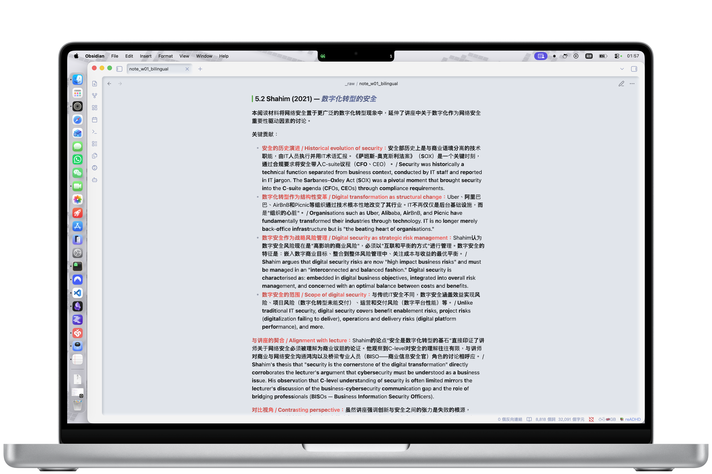
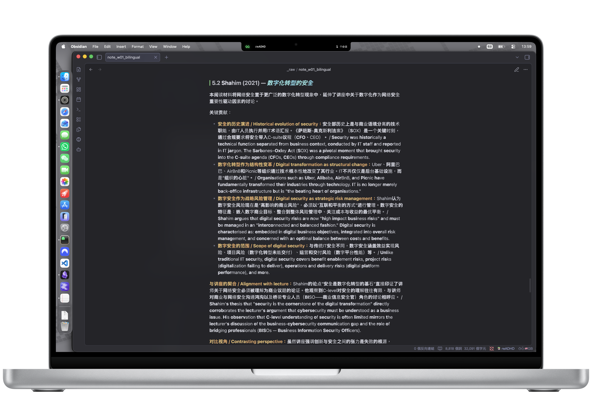
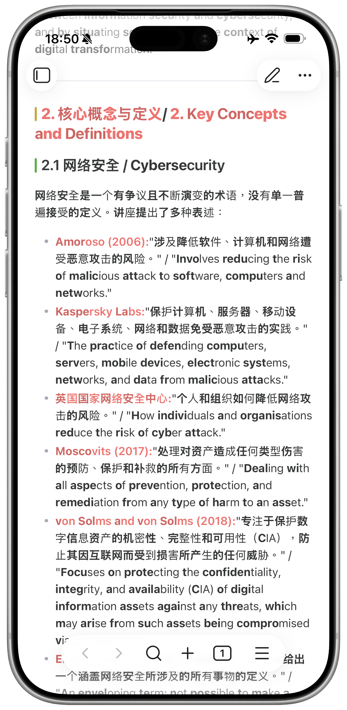
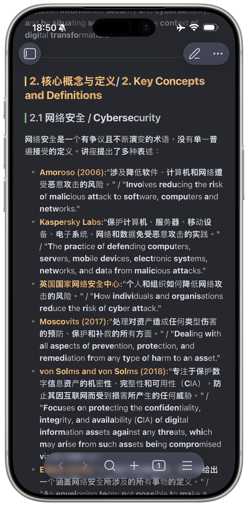

# 📚 reADHD — Obsidian 视觉强调阅读插件

**reADHD** 是一款专为 **Obsidian** 设计的插件，通过加粗词首引导视线，帮助 ADHD 人群提升阅读专注力。基于 jieba-wasm 实现中文智能分词，支持简体中文与繁体中文。

> **English**: reADHD is an Obsidian plugin designed for ADHD users, featuring visual emphasis reading with Chinese word segmentation. Automatically activates in Obsidian reading mode by default. Improved from Boninall's Obsidian-Better-Reading-Mode.

---

## 为什么做这个插件？

ADHD（注意力缺陷多动障碍）人群在阅读长文本时，常常遇到以下困难：

- **容易分心**：视线容易跳行、漏读
- **难以持续**：大段文字让人无法集中注意力
- **中文阅读障碍**：中文没有空格分隔，传统阅读辅助工具对中文支持不佳

该功能通过加粗每个词的前半部分，引导视线自然跳转，帮助大脑更快地捕捉关键信息，从而提升阅读速度和专注度。

**reADHD** 正是为解决这些问题而生——在 Obsidian 中自动为你处理视觉强调阅读，让你专注于内容本身。

---

## 特色功能

### 📖 阅读模式默认开启

插件**默认在 Obsidian 阅读模式自动生效**，无需手动切换。编辑模式（Live Preview、源码模式）完全无干扰，保证写作体验不受影响。

也可以在设置中关闭此行为，让视觉强调效果在所有模式下生效。

### 🀄 中文智能分词

基于 **jieba-wasm**（结巴分词 WASM 版）实现精准中文分词：

- 支持简体中文和繁体中文
- 分词后对每个词加粗前 50%，与英文仿生阅读逻辑一致
- jieba 加载失败时自动降级到浏览器内置 `Intl.Segmenter`

### 🌗 自适应深色/浅色模式

- 深色模式：强调粗体提亮 15%，与周围文字形成对比
- 浅色模式：强调粗体降低 15% 亮度，柔和不刺眼
- 强调文字自动继承标题、链接等格式化元素的颜色和字号

#### 💻 桌面端效果

*浅色模式下的视觉强调阅读效果*

*深色模式下的视觉强调阅读效果*

#### 📱 移动端效果

  
  

### 🚫 编辑模式零干扰

开启"仅在阅读模式生效"（默认开启）后，Live Preview 和源码模式下不会有任何强调效果，就像插件不存在一样。

---

## 安装方法

> 本插件仅适用于 **Obsidian** 笔记软件，支持桌面端和移动端。

### 通过 BRAT 安装（推荐）

1. 安装 [BRAT 插件](https://github.com/TfTHacker/obsidian42-brat)
2. 在 BRAT 设置中点击 **Add Beta Plugin**
3. 输入仓库地址：`chrisnch/reADHD`
4. 点击安装，然后在 Obsidian 设置中启用 reADHD

> 注意：目前通过 BRAT 安装时，BRAT 不一定会把额外的 `jieba_rs_wasm_bg.wasm` 一起放进插件目录。
>
> 这意味着：
> - **直接使用也完全可以**：插件会自动 fallback 到浏览器内置的 `Intl.Segmenter`，无需额外操作。
> - **如果你想启用更高精度的 jieba-wasm 中文分词**：请从 [GitHub Releases](https://github.com/chrisnch/reADHD/releases) 下载当前版本的 `jieba_rs_wasm_bg.wasm`，手动放到你的 vault 中 `.obsidian/plugins/reADHD/` 目录。
>
> 原因是当前版本的中文高精度分词依赖一个额外的 wasm 运行时文件，而 BRAT 的安装流程不一定会一起拉取这个额外文件。
>
> 后续版本计划会把 wasm 直接内嵌进插件 bundle，避免用户再手动补文件。

### 手动安装

1. 从 [GitHub Releases](https://github.com/chrisnch/reADHD/releases) 下载最新版本
2. 将 `main.js`、`manifest.json`、`styles.css`、`jieba_rs_wasm_bg.wasm` 复制到你的 vault 中 `.obsidian/plugins/reADHD/` 目录
3. 重启 Obsidian，在设置 → 社区插件中启用 reADHD
4. 如果你只复制了 `main.js`、`manifest.json`、`styles.css`，插件仍然可以运行，但中文分词会自动 fallback 到 `Intl.Segmenter`

---

## 使用方法

### 开关视觉强调阅读

- **状态栏**：点击底部状态栏的 📚 reADHD 图标，弹出菜单切换开关
- **命令面板**：`Ctrl/Cmd + P` → 输入 "Toggle reADHD mode"
- **设置面板**：Obsidian 设置 → reADHD → Toggle reADHD mode

### 设置选项

| 设置项 | 默认值 | 说明 |
|---|---|---|
| Toggle reADHD mode | 关 | 开启/关闭视觉强调阅读效果 |
| Only apply in reading mode | 开 | 仅在阅读模式生效，编辑模式无干扰 |

---

## 技术细节

### 中文分词

- **主方案**：[jieba-wasm](https://github.com/fengkx/jieba-wasm) — 基于 jieba-rs 编译的 WASM 模块，中文分词精度最高
- **降级方案**：浏览器内置 `Intl.Segmenter` — 无需额外依赖，分词精度稍弱但保证基本可用

当前版本中，如果插件目录里没有 `jieba_rs_wasm_bg.wasm`，插件会自动降级到 `Intl.Segmenter`。这在通过 BRAT 安装时尤其可能出现，因为 BRAT 不一定会一起安装额外的 wasm 文件。后续版本计划将 wasm 直接内嵌到 bundle 中，减少手动配置步骤。

### 加粗规则

| 词长 | 加粗比例 |
|---|---|
| 1 个字符 | 不加粗（英文 1 字符加粗 1 位） |
| 2-3 个字符 | 加粗前 1 个字符 |
| 4 个字符 | 加粗前 2 个字符 |
| 5+ 个字符 | 加粗前 50%（向上取整） |

英文单词遵循相同的比例规则。

---

## Credits

本项目基于 [Boninall](https://github.com/Quorafind) 的 [Obsidian-Better-Reading-Mode](https://github.com/Quorafind/Obsidian-Better-Reading-Mode) 改进而来，主要改进包括：

- 引入 **jieba-wasm** 实现中文智能分词，支持简繁中文
- 新增"仅在阅读模式生效"设置项，编辑模式零干扰
- 自适应深色/浅色模式对比度
- 移除 Live Preview 编辑器装饰扩展，简化代码

感谢原作者 Boninall 的出色工作。

---

## License

MIT